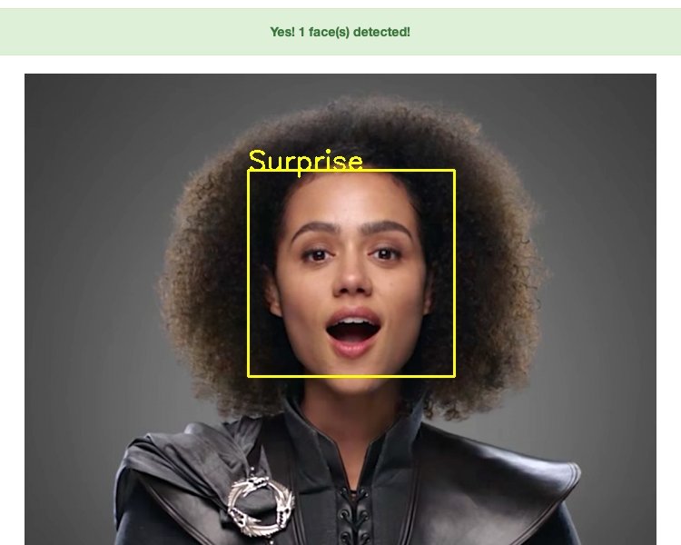

# The Web Application

> Author: Pradyumna Krishna 
> UPDATED: 24/12/2020

 

The web application hosted at <https://facial-ai.appspot.com> has simple UI. Contain two buttons as shown in image below:

    

First button `Browse` browses the file need to be uploaded and `Upload your image` button uploads it. It's a Simple Form where `Browse` button picks the file and `Upload your image` submit the form.

Error handling is used to maintain the web application running and display the error message. These error messages are:
- No image selected
- Please upload supported formats, e.g. png, jpg or jpeg
- Sorry, No face detected

    

If there is no error and image get uploaded successfully, web application predicts the emotion and draw the rectangle on the face(s) as shown in the image.

    

**Back: [Getting Started](Getting%20Started.md)** 
**Next: [Coming Soon](#)**